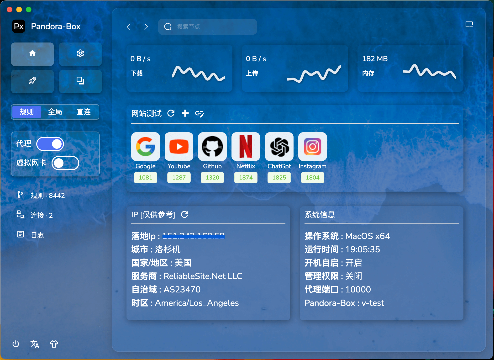
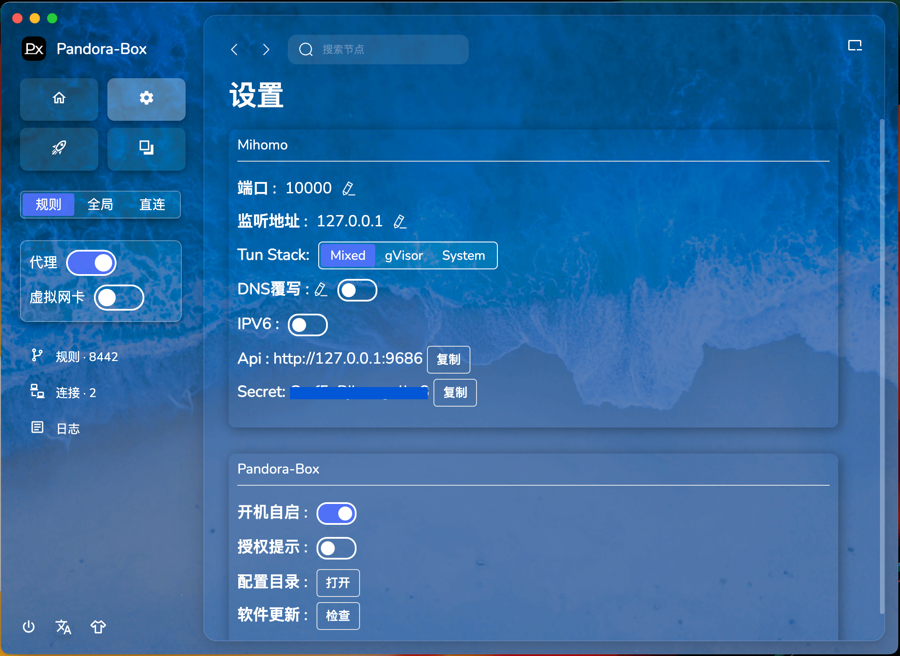
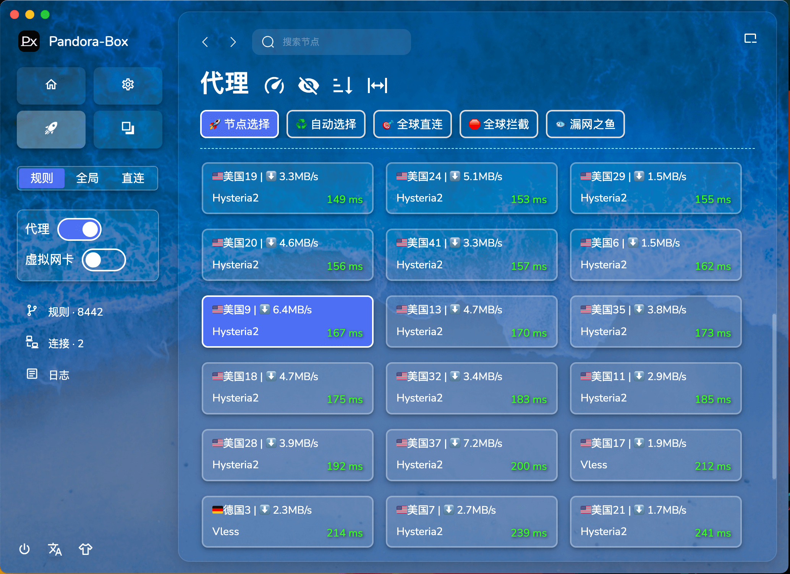

  
  <h1>Pandora-Box</h1>
  
一个简易的 Mihomo 桌面客户端

## 下载地址

[下载APP](https://github.com/snakem982/Pandora-Box/releases)

## 功能特点

- 支持本地 HTTP/HTTPS/SOCKS 代理
- 支持 Vmess, Vless, Shadowsocks, Trojan, Tuic, Hysteria, Hysteria2, Wireguard, Mieru 协议
- 支持分享链接、订阅链接、Base64 格式、Yaml 格式的数据解析
- 内置订阅转换，可将各种订阅转换为 mihomo 配置
- 对无规则订阅自动添加极简规则分组
- 开启 DNS 覆写可防止 DNS 泄露
- 支持统一所有订阅的规则和分组
- 支持 TUN 模式

## 支持的系统平台

- Windows 10/11 AMD64/ARM64
- macOS 11.0+ AMD64/ARM64
- Linux AMD64/ARM64

## 如何开启 TUN

- 设置 → 开启授权 → 重启软件 → 弹出授权框 → 完成授权
- 进入软件后即可开启 TUN 模式

## 提示 Px 需要网络接入

- 点击 “允许” 即可

## macOS 常见问题汇总

- [mac.md](mac/mac.md)

## 新版主要改进

1. 界面改版：支持背景切换、语言切换、拖拽导入
2. 顶部搜索当前配置节点，快速切换
3. 增加最小化到托盘功能
4. 统一规则模板：简约分组、多国别分组、全分组
5. 暂未迁移 v0.2 版本的爬取模块、导入导出模块

## Todo 未来计划

- 爬取模块
- 导入导出模块
- 服务模式，开机自启
- Bug 修复

## 预览

| 页面 | 界面预览                          |
|----|-------------------------------|
| 首页 |       |
| 设置 |    |
| 代理 |    |
| 订阅 |  |
